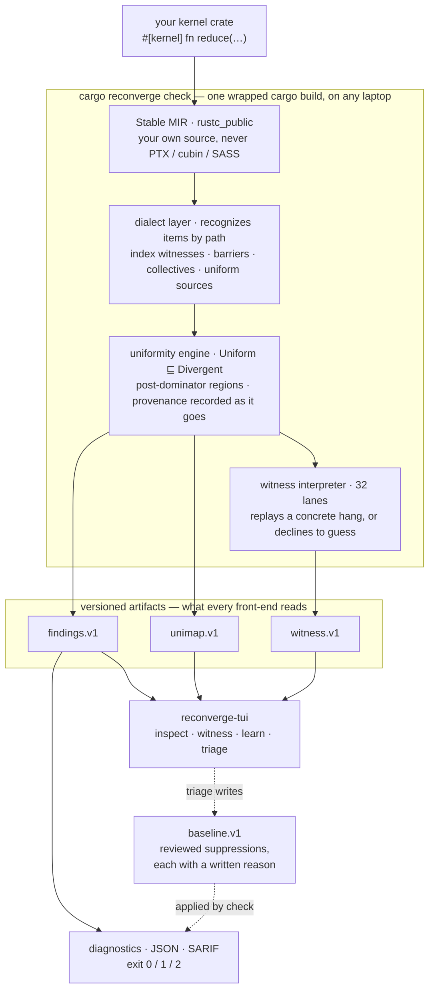
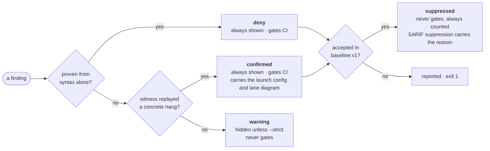

# reconverge

> Static reconvergence analysis for Rust GPU kernels — catches divergent
> barriers and non-convergent warp operations at compile time, and shows you
> why, lane by lane, in your terminal. **No GPU required.**


[](https://crates.io/crates/cargo-reconverge)


[](https://github.com/vyncint/reconverge/actions/workflows/ci.yml)

> The analysis, the four terminal views, and the CI integration are
> complete and tested, and every crate is on crates.io. Works with kernels
> written using [cuda-oxide](https://github.com/NVlabs/cuda-oxide).

## The problem

A GPU runs your kernel once per thread, and the hardware drives those threads
in groups of 32 called **warps**. The 32 slots of a warp are its **lanes**.
Two mistakes in that model are unusually hard to debug:

- **A divergent barrier.** `sync_threads()` waits for every thread in the
  block. If a branch lets only some threads reach it, the rest never arrive
  and the block waits forever. There is no error, no log line, and no stack
  trace — just a kernel that never finishes.
- **A non-convergent warp collective.** Operations like `ballot_sync` take a
  mask naming which lanes take part. If a named lane is not there, the result
  is undefined. This one often does not even hang: it returns a wrong value
  and your data carries it onward.

Neither bug is visible in the source, because what goes wrong — 32 lanes
disagreeing about where they are — is never written down in the program. And
owning the hardware does not help: a hung GPU cannot tell you which lanes are
missing or which branch sent them away.

reconverge finds both at compile time, on any laptop, and shows you the
disagreement:

```rust
#[kernel]
pub fn rc001_divergent_barrier(mut out: DisjointSlice<u32>) {
    let i = thread::index_1d();
    if i.get() % 2 == 0 {
        thread::sync_threads();   // only the even lanes ever arrive
    }
    // …
}
```

```console
$ cargo reconverge check
error[RC001]: kernel `rc001_divergent_barrier` may execute `sync_threads()` under thread-divergent control
  --> src/lib.rs:129:9
    |
129 |         thread::sync_threads();
    |         ^^^^^^^^^^^^^^^^^^^^^^
   = note: lanes that skip the barrier never arrive, and the lanes that reach it wait for them
           forever — on hardware this is undefined behavior, usually a permanent hang with no error
   = note: witness: replayed with grid (1,1,1) x block (32,1,1), warp 0 — 16 of 32 lanes wait at
           `sync_threads()` while 16 never arrive; the barrier cannot be satisfied
   = note: lanes 0..31 at the failure point: W.W.W.W. W.W.W.W. W.W.W.W. W.W.W.W.
   = note: (W = reaches the call, . = never arrives)
   = provenance: thread-divergent branch (src/lib.rs:128)
   = provenance: _7: result of `ThreadIndex::get` on divergent _8 (src/lib.rs:128)
   = provenance: _8: derived from divergent `i` (src/lib.rs:128)
   = provenance: `i`: thread-index witness `index_1d()` (src/lib.rs:125)
   = help: make every thread of the block reach the barrier: hoist it out of the divergent
           branch, or make the branch condition uniform
```

Three things in that output are worth pointing at:

- **`witness:`** means this was not a guess. An interpreter ran your kernel's
  own compiled form for 32 lanes, with a concrete launch configuration, and
  watched the barrier starve.
- **`lanes 0..31`** is the warp at the moment it stops: `W` waits forever,
  `.` left without arriving.
- **`provenance:`** walks backwards from the branch to the thread index that
  made it differ per lane — one hop at a time, so you can see *why* the
  condition is not the same for every thread.

## Why this cannot be a runtime check

You might expect to catch these by running the kernel. You cannot, reliably:
these are exactly the bugs a GPU is worst at reporting.

| | needs a GPU | needs the failing input | sees the mask | points at the source | explains why |
|---|---|---|---|---|---|
| **reconverge** | no | no | yes | yes, with provenance | yes, and replays it |
| the vendor's dynamic checker (`compute-sanitizer synccheck`) | yes | yes | partly | at the launch | no |
| running it and watching | yes | yes | no | no | no |
| GPUVerify (research, pre-Volta) | no | no | no — predates masked warp primitives | yes | partly |
| Clippy and friends | no | no | no — no SIMT model at all | yes | n/a |

A runtime checker only sees the launch you happened to run. A static analysis
sees every launch your code allows. reconverge does both at once: it proves
the problem exists for some launch, then produces one concrete launch that
triggers it.

## How it works



Nothing on that path touches a GPU vendor SDK. The analysis reads *your* Rust
through the compiler's own intermediate form, and the warp rules it checks
against come from public documentation. That is why it runs anywhere: in CI,
on a laptop, in a container, with no driver installed.

## What it catches

| Code | Tier | Finding | Explain |
|---|---|---|---|
| `RC001` | confirmed / warning | `sync_threads()` reachable under thread-divergent control | [read](crates/cargo-reconverge/explain/RC001.md) |
| `RC002` | confirmed / warning | warp collective at a non-convergent point, or a mask naming absent lanes | [read](crates/cargo-reconverge/explain/RC002.md) |
| `RC003` | deny | `&mut [T]` as a `#[kernel]` parameter — one exclusive reference handed to every thread | [read](crates/cargo-reconverge/explain/RC003.md) |
| `RC004` | deny | static shared memory over the target's limit | [read](crates/cargo-reconverge/explain/RC004.md) |
| `RC005` | warning | launch-contract inconsistency | [read](crates/cargo-reconverge/explain/RC005.md) |

`RC006`/`RC007` (coalescing and bank-conflict lints) are reserved for v1.1.
Every code has an explain page you can read in the terminal:
`cargo reconverge --explain RC001`.

### The confidence ladder

Findings are ranked by how they were established, not by how alarming they
sound. The goal is that every finding shown by default is one you would
defend in code review.



**Zero false positives at default confidence is a requirement, not a goal.**
Every CI run pushes all of upstream's example kernels through the tool; any
finding that has not been reviewed fails the build. Precision and recall are
measured against a corpus of mechanically injected bugs and published in
[`conformance/MUTATION.md`](conformance/MUTATION.md), which CI regenerates so
the numbers cannot quietly go stale.

## Four views in the terminal

How threads actually execute is invisible in source code, so half of this
project is about making it visible. All four views read the same artifacts
the analysis writes; none of them re-runs the analysis, and all work
offline.

```console
$ cargo reconverge witness            # step one warp through a recorded replay
```

```
┌ reconverge witness ──────────────────────────────────────────────────────────┐
│witness 1/2 — kernel `rc001_divergent_barrier` — RC001 — grid (1,1,1) block (…│
│                                                                              │
│          0        8        16       24                                       │
│lanes     WoWoWoWo WoWoWoWo WoWoWoWo WoWoWoWo                                 │
│mask      (not at a warp collective)                                          │
│                                                                              │
│          o active   W waiting   . exited                                     │
│                                                                              │
│step 2/3  [=>.]                                                               │
│sync_threads() — 16 of 32 lanes arrive and wait                               │
│at lib.rs:180                                                                 │
│barrier: 16 of 32 threads arrived                                             │
│                                                                              │
│   0  launch                                                                  │
│   1  lanes evaluate the guarding branch — 16 continue toward `sync_threads`,…│
│▸  2  sync_threads() — 16 of 32 lanes arrive and wait             16 waiting  │
│   3  the other 16 lanes exit or move past reconvergence without ever reachin…│
│                                                                              │
│verdict: undefined behavior (at step 3)                                       │
│                                                                              │
│                                                                              │
│                                                                              │
└ h/l step  g/G ends  d split  v verdict  n/N witness  q quit ─────────────────┘
```

| View | Command | What it is for |
|---|---|---|
| **inspect** | `cargo reconverge inspect` | browse source with uniformity labels; walk a value's provenance to its divergence source |
| **witness** | `cargo reconverge witness` | step one warp through the replay: 32 lanes, barrier arrivals, mask vs. active — with the whole run listed beside it, so the shape of the bug is legible without stepping |
| **learn** | `cargo reconverge learn` | four lessons — divergence, barriers, masks, reconvergence — driving the same replay engine over shipped recordings, fully offline |
| **triage** | `cargo reconverge triage` | review findings and record the accepted ones, with reasons, in the baseline |

An [asciinema recording](docs/demo/witness-debugger.cast) of the debugger
walking the canonical hang and the mask mismatch is in `docs/demo/`.

## Install

Three binaries cooperate: the CLI, the analysis driver, and the terminal
views. Install the CLI, then let it fetch its own matching pieces:

```console
$ cargo install cargo-reconverge
$ cargo reconverge setup
```

`setup` installs the pinned nightly toolchain — a rustc-driver tool must be
built by the exact rustc it wraps — and `reconverge-driver` +
`reconverge-tui` at the CLI's own version, printing every command before it
runs. Prefer to do it yourself? The equivalent is (the `@VERSION` pins
matter — all three binaries must be the same version, so pin both to the
version of `cargo-reconverge` you installed):

```console
$ rustup toolchain install nightly-2026-04-03 --profile minimal --component rustc-dev --component llvm-tools
$ rustup run nightly-2026-04-03 cargo install --locked reconverge-driver@VERSION reconverge-tui@VERSION
```

`rustc-dev` is the component that matters: the driver links rustc's own
crates, and without it the build fails with four `E0463`s naming
`rustc_driver`, `rustc_interface`, `rustc_middle` and `rustc_public`
rather than the one missing argument. A git checkout inherits the
components from this repository's `rust-toolchain.toml`; a crates.io
install carries no toolchain file, so it has to be asked for. The
driver's build script checks for it and says so directly.

## Using it

```console
$ cargo reconverge check                       # analyze; exit 1 on deny/confirmed findings
$ cargo reconverge check --strict              # include warning-tier findings
$ cargo reconverge check --cc 8.6              # target capacity context for RC004
$ cargo reconverge check --sarif out.sarif     # SARIF 2.1.0 for code scanning
$ cargo reconverge check --message-format json # one findings.v1 document per target
$ cargo reconverge watch                       # re-run on every save
$ cargo reconverge --explain RC002             # why it is a bug, and the idiomatic fix
```

Exit codes: `0` clean, `1` findings at deny/confirmed confidence, `2` tool
error. In CI, the [GitHub Action](action/README.md) is three lines:

```yaml
- uses: actions/checkout@v7
- uses: vyncint/reconverge/action@main
  with:
    cc: "8.6"
```

### Accepting a finding

A finding you have reviewed and decided to live with goes in
`reconverge-baseline.json`, written by `cargo reconverge triage`, which
requires a reason for every entry. An accepted finding is a decision, not a
disappearance: it stops gating CI, but it is still counted in every summary,
still printed by `--show-suppressed` with its reason, and still exported to
SARIF as a suppression carrying that reason as the justification. Entries
match on `(crate, kernel, code)` — never on line numbers, which move the
first time anyone edits above them.

## Limitations

What reconverge does not do. A tool that overstates its reach is worse than
one that does less.

- **The decidable slice only.** Uniformity is computed as dataflow; there is
  no SMT solver and no general race freedom. Data races are out of scope —
  deleting a barrier is a race, and no static tier here will flag it.
- **Reducible CFGs.** An irreducible control-flow graph degrades to
  all-divergent for that function, and the diagnostic says so rather than
  pretending otherwise.
- **Interprocedural analysis is summary-based in v1** — per-function
  `may_contain_barrier` / `may_contain_warp_op` bits, no context sensitivity.
  A call-site finding is still raised from those bits alone.

  It is witness-promoted only when the callee can be *inlined*, which
  replaces "the summary says this may reach a barrier" with an actual
  path: non-recursive callees, at most two frames, and a ceiling on the
  spliced result. Anything outside those bounds — recursion, a deeper
  chain, a callee whose body was not modeled — keeps the summary tier and
  stays at `warning`. Nothing is promoted on a summary bit; the bit raises
  the finding, a trace confirms it.
- **RC001 covers the all-threads barriers** — `thread::sync_threads`,
  `cluster::cluster_sync`, and `grid::sync`, whose shared contract is that
  every thread of the scope must reach the call. The mbarrier arrive/wait
  family (`barrier::Barrier`) is deliberately out: it is a phase-counted
  split barrier where partial participation is the designed use, so
  divergence at the wait is not by itself a bug.
- **RC002 covers the whole collective surface** — every `*_sync` function
  of cuda-device's `warp` module (mask-first by convention), plus
  `sync_mask`, plus the unmasked convenience wrappers (`warp::shuffle`,
  `warp::ballot`, `all`, `any`, `popc`, the `reduce_*` helpers). The
  wrappers take no mask argument, but they are the thing that supplies
  one — each delegates to its `*_sync` counterpart with `u32::MAX` — so
  the mask is known from the call rather than inferred from a callee the
  analysis cannot see, and `warp::ballot(x)` under divergence is treated
  exactly like `warp::ballot_sync(0xffff_ffff, x)`.

  The `reduce_*_partial` helpers are the one collective whose mask is
  neither full nor an argument: they build it from a runtime `live_lanes`
  value. They are still reported, with the mask named as not evaluable —
  a warning that says "found this, cannot check the mask" rather than the
  silence of not looking at all.
- **A construct the declared launch cannot reach is reported at `warning`
  and never promoted.** The syntactic recognizer speaks — a launch
  contract is a declaration, not a proof, and a kernel launched outside
  its declared shape would otherwise lose the diagnostic entirely — while
  the replay finds no lane that arrives and so has nothing to confirm.
  Such findings never gate, and they carry a `replay:` note naming that
  outcome — "unreachable under the declared launch" is close to knowledge,
  and is now distinguishable, by a reader and by anything consuming
  `findings.v1`, from a construct the replay simply could not evaluate.
- **RC002's replay compares the mask against the lanes present.** A
  literal mask at a divergent call promotes to `confirmed` exactly when it
  names a lane the replay proves absent; a mask naming exactly the arriving
  lanes — the guarded partial-warp idiom — is never promoted and never
  gates, and now says so: the finding carries a `replay:` note recording
  that the mask was checked against the lanes present and matched, so a
  verified idiom no longer reads like a mask the tool could not evaluate. What the replay does *not* do is mask arithmetic against launch
  shapes other than the one it runs (one full warp).
- **`active_mask` guards stay warnings; the positional mask registers do
  not.** The five `lanemask_*` registers are closed forms of the lane's own
  ordinal — `lanemask_lt` is every lane below it, and so on — so they do
  not depend on which lanes are still running, and the replay evaluates
  them. The lane-ordinal idiom `warp::lanemask_lt().count_ones()` replays,
  and a guard on it is witness-promoted like any other. `warp_id` and
  `live_lanes_1d` are exact under the replayed launch too.

  `active_mask` is the exception, and for a different reason: its value is
  the set of lanes still live at that point, which changes as lanes
  diverge. That is path-dependent rather than positional, so it stays
  unknown, findings under such a guard are never witness-promoted, and a
  finding *below* one with a barrier inside it stays at warning too.

  The arithmetic a 32-bit mask flows through is width-typed: integer `!`
  is the complement at the operand's own width, casts truncate to their
  target width, and overflow-checked arithmetic was already width-typed.
  Where a width is unavailable the interpreter yields unknown rather than
  assuming one.

- **Every site is attempted, but an unknown branch over a barrier stops the
  ones below it.** Promotion is per site, so a function with several
  divergent sites can carry several witnesses, whatever mix of divergence
  sources they use. An unevaluable guard upstream does not by itself cost
  the sites below it either: when the branch's paths rejoin without
  touching a synchronization point, the choice cannot change who arrives,
  so the replay skips it.

  Two things do stop a later site, and both are cases where no lane
  reaches it rather than cases the replay gave up on:

  - an **unevaluable branch whose paths contain** a barrier or collective —
    those lanes may be waiting there and may never arrive, so the replay
    declines rather than naming a lane split it cannot stand behind; and
  - **earlier barriers that already deadlock the block** between them. If
    one guard sends half the lanes to a barrier and its complement sends
    the other half to a different one, both halves wait forever and
    nothing continues past them. A third site below is unreachable in
    fact, not merely unproven.

  In both, the finding stays at `warning` and the upstream barrier is
  itself reported — which is where the reader should be looking anyway.
- **Whole-warp divergence is witnessed at the declared block.** When the
  one-warp replay finds nothing and the kernel's `#[launch_contract]`
  declares a one-dimensional block of several whole warps (64, 96, or
  128), barrier findings are replayed again at that size — so a
  `warp_id()`-guarded barrier that is safe at one warp and undefined at
  two gates exactly when the contract says two. Blocks that are 2D, not
  whole warps, or wider than 128 threads stay at the one-warp replay.
  A collective on a lane's path does not stop the replay: collectives
  are modeled per warp, so a warp whose still-running lanes are all at the
  same collective passes it whatever the other warps are doing, while the
  barrier remains the only construct that synchronizes across warps. A
  configuration that would need warps to interact — a warp split between a
  warp-scoped collective and a block-scoped barrier — is declined rather
  than approximated. The *site* itself must still be a barrier beyond one
  warp: a mask comparison is a per-warp question, and an error there would
  produce a witness that looks exactly like a correct one.
- **Opaque regions are reported, not guessed at.** `asm!` and unmodeled
  intrinsics are counted, and the tally is a property of the *run*, not of
  a finding: it rides in `findings.v1` as `coverage`, is printed as a note
  on every finding in the affected kernel, and closes the summary line
  whenever anything was left unread — including a run with no findings at
  all. That last case is the one it exists for: a `bar.sync 0` inside an
  `asm!` block under a divergent guard is a real barrier this tool cannot
  see, and `0 deny, 0 confirmed, 0 warning findings` on its own does not
  say whether the kernel is clean or whether a twentieth of it was never
  read.
- **Masks that are not literals** — a named `const`, or anything computed —
  cannot be evaluated through `rustc_public` at the pinned toolchain, so
  RC002 reports convergence and says the mask was not evaluable rather than
  guessing at it. The boundary is the exposed surface rather than the
  compiler's ability: a named `const` arrives as `ConstantKind::Unevaluated`
  where a literal arrives as `Allocated`, `ConstDef` offers no way to read
  the initializer, and the one evaluation entry point on `MirConst`,
  `eval_target_usize()`, assumes a `usize` and ICEs on a `u32` mask
  ("expected int of size 8, but got size 4") — after resolving the value,
  so what is missing is an API that returns it at its own width.
- **The pinned nightly is not optional.** A rustc-driver tool and the rustc
  it wraps must be the same build; the pin matches upstream cuda-oxide's own.

## Status

Everything on this page is implemented and gate-tested: the five diagnostics with their witness promotions, the four terminal views, the GitHub Action, the conformance gate, and the mutation corpus behind the published numbers. reconverge is released and published on crates.io. Two hardware sessions are still planned to calibrate verdict wording against real silicon, but they are no longer a release blocker.

Next on the engineering side: `RC006`/`RC007`, the coalescing and
bank-conflict lints, with the lanes-to-address-grid visualizer that goes
with them.

## Documentation

| Document | What is in it |
|---|---|
| [`docs/ARCHITECTURE.md`](docs/ARCHITECTURE.md) | how the pieces fit: crate graph, the analysis pipeline in detail, the artifact contract, isolation invariants, test strategy |
| [`docs/explain/`](docs/explain/) | one page per diagnostic code: a minimal failing kernel, the hardware reason, the idiomatic fix |
| [`docs/learn/`](docs/learn/) | the four SIMT lessons (also embedded in `cargo reconverge learn`) |
| [`schemas/`](schemas/) | the versioned JSON Schemas — the contract between the engine and every front-end |
| [`conformance/`](conformance/) | how the zero-false-positive gate and the mutation corpus work, plus [the published precision/recall table](conformance/MUTATION.md) |
| [`CONTRIBUTING.md`](CONTRIBUTING.md) | dev setup, testing policy, commit conventions, review rules for the baseline |
| [`CHANGELOG.md`](CHANGELOG.md) | what has landed, and the corpus *and* found-in-the-wild numbers behind it |

## Contributing

Issues and pull requests are welcome — including, especially, false
positives: there is a
[dedicated issue form](.github/ISSUE_TEMPLATE/false_positive.yml) for them,
and every confirmed one becomes a permanent regression test before it is
fixed.

Development needs the pinned toolchain and
[`just`](https://github.com/casey/just):

```console
$ just setup    # materialize the toolchain, wire the local hooks
$ just ci       # everything CI gates on: fmt, clippy, tests, docs, deny, isolation
```

AI assistance is welcome; AI attribution is not. Remove the trailer and
recommit — you are the author of record.

## License

Dual-licensed under either of

- Apache License, Version 2.0 ([LICENSE-APACHE](LICENSE-APACHE))
- MIT license ([LICENSE-MIT](LICENSE-MIT))

at your option. Contributions are accepted under the same terms, signed off
under the [Developer Certificate of Origin](https://developercertificate.org/)
(`git commit -s`).
