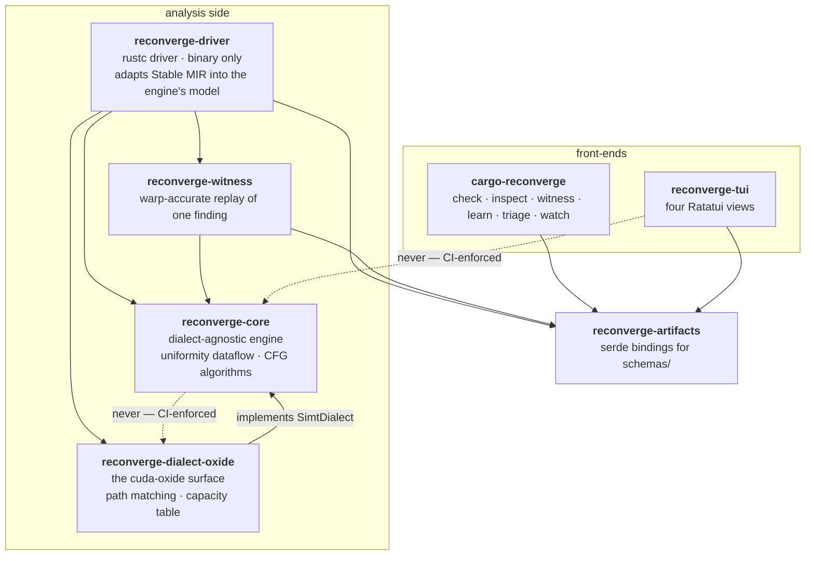
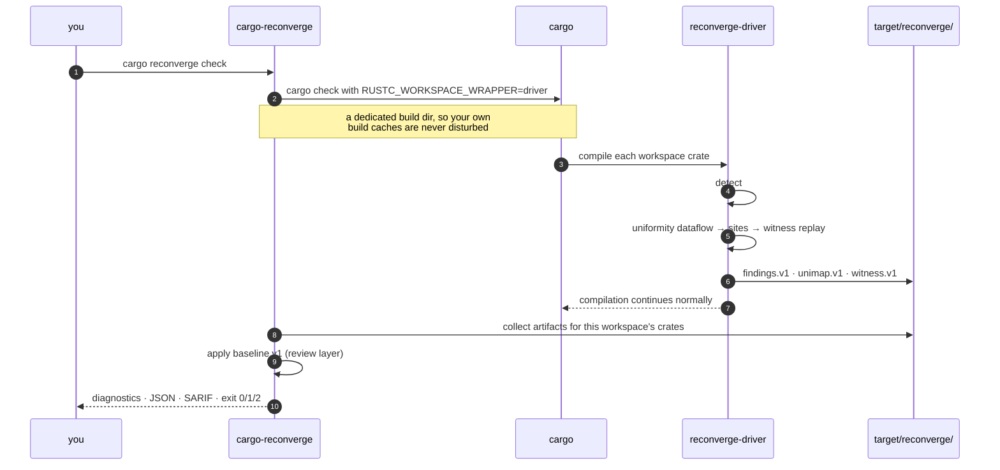
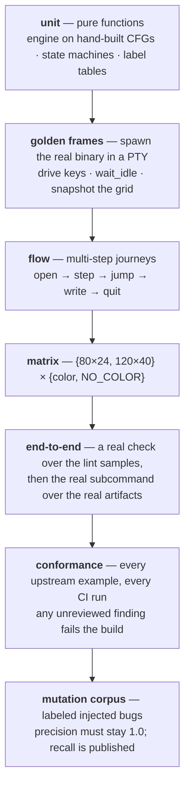

# Architecture

How reconverge is put together, and why. The [README](../README.md) says what
the tool does; this page says how it works inside, for people changing it.

## Crates

Two rules are checked by `scripts/check-isolation.sh` on every CI run. Both
are easy to break by accident and expensive to undo later:

- **The engine never depends on the dialect.** `reconverge-core` takes a
  `SimtDialect` trait instead: the dialect tells it which calls are thread
  indices, barriers, collectives, and uniform sources. Supporting another GPU
  frontend later means writing a new dialect, not touching the analysis. It
  also keeps the engine free of compiler types, which is why the whole
  dataflow can be tested on hand-built control-flow graphs with no compiler
  involved.
- **The TUI depends only on `reconverge-artifacts`.** It reads the JSON the
  analysis writes and nothing else. If a view needs data the artifacts do not
  carry, the fix is to extend a schema — never to reach into the engine.

## One `check` run

Two details worth knowing:

- **Kernel detection.** The `#[kernel]` attribute does not survive macro
  expansion — upstream's proc macro consumes it and re-emits the function
  renamed under its reserved naming contract with `#[unsafe(no_mangle)]`. So
  the renamed item *is* the marker and *is* the symbol, and detection is one
  path match (`reconverge_dialect_oxide::kernel_base_name`).
- **Freshness.** Findings files persist between runs, and cargo's own
  freshness tracking decides when a crate is recompiled — and therefore
  re-linted. The one input cargo cannot see is `--cc`, so changing it drops
  the wrapper's build fingerprints to force a re-lint.

## The engine

The analysis is the one in docs/ARCHITECTURE.md, implemented over a compiler-free
model IR the driver builds from Stable MIR.

- **What "uniform" means.** A value is *uniform* when every active lane holds
  the same value at that point in the program, and *divergent* otherwise.
  Each value starts optimistic (uniform) and the analysis repeats until
  nothing changes. This is a statement about values, not about timing:
  threads in a warp are not guaranteed to advance together, and nothing here
  assumes they do.
- **Divergence sources.** Thread-index witnesses, lane ids, loads from
  thread-dependent addresses, atomic return values. Uniform: kernel
  parameters, `block_idx`-derived expressions, constants.
- **Control dependence.** When a branch is divergent, everything between it
  and the point where its paths rejoin (its immediate post-dominator) is
  divergent too. Computing that rejoin point counts only *real* returns as
  exits: if a panic or an unreachable arm counted, the region would stretch
  too far and the common "thread 0 initializes, then everyone syncs" pattern
  would be flagged when it is perfectly fine.
- **Provenance is mandatory** and recorded *during* the dataflow, not
  reconstructed afterwards: every divergent value keeps the def→use chain
  back to its source. That chain is what the diagnostics print and what the
  Inspector walks.
- **Interprocedural (v1).** Per-function summary bits
  `may_contain_barrier` / `may_contain_warp_op`; a call carrying a bit under
  divergent control is a finding at the call site, at `warning`, never
  witness-promoted.
- **Degrades are declared.** An irreducible CFG degrades to all-divergent for
  that function and says so; opaque statements (`asm!`, unmodeled
  intrinsics) are counted and carried in `findings.v1` as a run-level
  `coverage` block — printed as a note on every finding in the affected
  kernel, and on the summary line whenever anything was left unread, so a
  run with no findings still declares what it could not see.

## The witness interpreter

Findings above `warning` go to a lane interpreter that runs the same model
the engine analyzed. It is deliberately not a kernel runtime: it exists to
turn "this could hang" into "here is the launch where it does."

One warp is the ordinary replay. When it finds nothing and the kernel's
`#[launch_contract]` declares a one-dimensional block of several whole warps,
barrier findings are replayed again at the declared width (64, 96 or 128) —
so a `warp_id()`-guarded barrier that is safe at one warp and undefined at
two is promoted exactly when the contract says two. Blocks that are 2D, not
whole warps, or wider than 128 threads stay at the one-warp replay.

- **It only runs as far as it must.** A lane stops as soon as it either
  reaches the site in question or enters code from which that site can no
  longer be reached. Unknown values elsewhere in the kernel therefore cannot
  spoil a replay that never needed them.
- **Branches it cannot decide are skipped, not guessed.** If both arms of an
  unknown branch rejoin before the site, and nothing in between synchronizes
  or loops, the whole region is skipped and every value it might have written
  is marked unknown. That is what lets an ordinary bounds check like
  `gid.in_bounds(n) && …` sit in front of a replay without blocking it.
- **Honesty rails.** Anything else unknown — a branch on a parameter, a loop
  past the step budget, an unmodeled operation — aborts the replay: *no
  witness, the static result stands*. Interprocedural sites and collectives
  whose mask cannot be evaluated are never promoted, and a constant mask that
  exactly matches the arriving lanes (the guarded partial-warp idiom) is
  correctly not a finding.
- **Calibrated verdicts.** Hardware behavior is described as "usually" a
  hang, never "always"; the per-compute-capability data behind that wording
  comes from the human-run hardware sessions in [`hardware/`](hardware/).

## Artifacts: the contract

Everything the engine learns leaves through versioned JSON, and every
front-end reads only that. The schemas live in [`schemas/`](../schemas/) and
are semver'd independently of the crates; within a major version they are
additive-only, and every schema change updates [`fixtures/`](../fixtures/) in
the same PR because the fixtures are the API tests.

| Schema | Produced by | Read by |
|---|---|---|
| `findings.v1` | the driver | CLI text/JSON/SARIF, triage view |
| `unimap.v1` | the driver | Inspector |
| `witness.v1` | the driver | witness debugger, learn mode |
| `baseline.v1` | **a human**, via `cargo reconverge triage` | CLI review layer |

`baseline.v1` is the odd one out on purpose. Suppression is a *review
decision*, not an analysis result, so it lives outside `findings.v1` and the
driver never reads it — which is what keeps the findings artifact a faithful
record of what the engine actually found, whatever anyone later decided about
it. The CLI's `review` module is the single place that combines the two, so
the text renderer, the SARIF writer, and the exit code cannot drift apart on
what "suppressed" means.

## Front-ends

**CLI** (`cargo-reconverge`). `check` owns the exit-code contract; the other
subcommands are launchers and loops around it. `watch` is a text surface
rather than a TUI view, on purpose: watching needs either a timer (the TUI
forbids them — see below) or an OS-notification crate whose license is
outside the `deny.toml` allowlist, which is a stop-and-ask rather than a
quiet dependency.

**TUI** (`reconverge-tui`). Four views, all testable by construction:

- **Event-driven rendering only** — redraw on input or data change, no
  timers, no animation. This is what makes termlens's quiet-period
  synchronization reliable, and it is why `watch` lives in the CLI.
- **State = f(artifacts, key sequence).** Every transition is a pure function
  in a `state` module with no I/O, so any screen is reproducible from a
  fixture plus a scripted key list. The one exception is triage's write,
  which the state only *requests* — the event loop performs it, aimed at the
  single path the launcher named.
- **Deterministic frames**: no wall-clock, PID, or absolute paths; dynamic
  values go through redaction helpers. `NO_COLOR` is honored, `--ascii`
  transliterates every glyph, and strings are NFC-normalized on load.
- **Unicode-safe by construction.** Display widths come from
  `unicode-width`, truncation happens on grapheme boundaries, and text is
  NFC-normalized on load — so a reason typed with accents cannot corrupt a
  frame or lose half a letter to backspace.

## How it is tested

Two policies matter more than the pyramid:

- **Flakiness.** TUI tests synchronize only through content predicates and
  quiet periods — never `sleep`. A flake is quarantined the same day and
  root-caused as either a determinism bug here or a termlens issue filed
  upstream with a reduction. TUI tests are never skipped-but-green.
- **The ratchet.** Every escaped bug and every false positive becomes a
  permanent regression test *before* it is fixed. Confidence only moves up.

Conformance deserves one note: upstream's examples are host+device programs
whose host half runs `bindgen` against a vendor SDK header at build time, and
requiring that SDK anywhere is forbidden here. So `conformance/extractor`
splices out the device side — the analysis surface anyway — into kernel-only
crates. The receipts, the extraction floor, and the mutation operators are
documented in [`conformance/README.md`](../conformance/README.md).

## Toolchain and policy constraints

- **The nightly pin is load-bearing.** A rustc-driver tool must be built by
  the same rustc it wraps; `rust-toolchain.toml` matches upstream
  cuda-oxide's pin exactly, and bumping it is a deliberate, reviewed act.
- **`rustc_public` only.** The analysis uses Stable MIR; the unstable
  `rustc_driver`/`rustc_interface` imports exist solely because there is no
  stable driver entry point yet, and they are confined to the driver's binary
  target so no workspace test needs rustc's dylibs at runtime.
- **No vendor SDK, anywhere.** Nothing links, invokes, or parses a GPU
  vendor SDK component — no PTX, cubin, or SASS handling at all. Upstream
  APIs are recognized by path matching, the way Clippy recognizes
  `Option::unwrap`; no upstream code is vendored.
